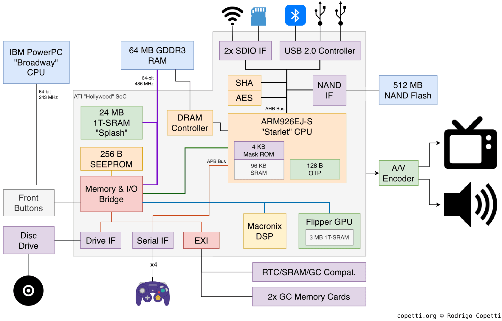

# Hollywood SoC Simulator

### Diagram

### References

- [Starlet - via WiiBrew](https://wiibrew.org/wiki/Hardware/Starlet)
- [Starlet - via ARM Developer](https://developer.arm.com/documentation/ddi0198/e/introduction/about-the-arm926ej-s-processor)
- [Hollywood SoC - via Wikipedia](https://en.wikipedia.org/wiki/Hollywood_(graphics_chip))
- [Wii Architecture - via WiiBrew](https://wiibrew.org/wiki/Wii_architecture_overview)
- [Wii Architecture - via Copetti](https://www.copetti.org/writings/consoles/wii/)
- [NAND API - via Internet Archive](https://ia902803.us.archive.org/view_archive.php?archive=/32/items/WiiDevelopmentPackage/wii_development_package.zip&file=wii_development_package%2FRVL_SDK%2Fman%2Fen_US%2Fnand%2Fintro.html)
